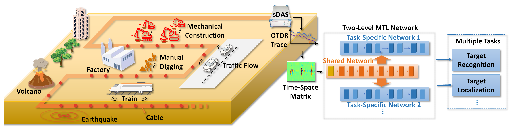
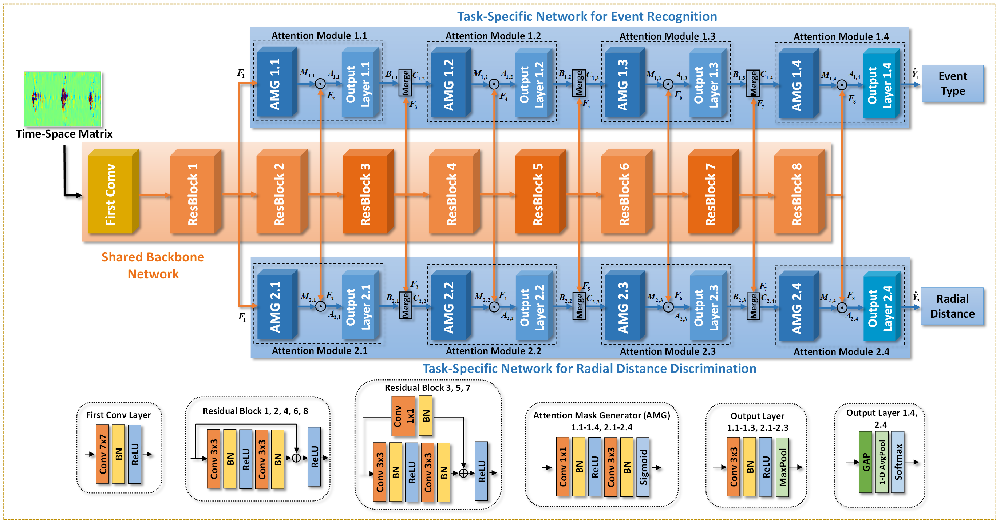

# MTL-sDAS.PyTorch
This repository contains the source code and the dataset in the paper: "Smart Fiber-Optic Distributed Acoustic Sensing (sDAS) with Multi-Task Learning for Time-Efficient Ground Listening Applications".


## Introduction

Fiber-optical distributed acoustic sensing (DAS) has been applied to various large-scale infrastructure monitoring areas in smart city. In this paper, a two-level multi-task learning (MTL) enhanced smart fiber-optical distributed acoustic sensing (sDAS) system is proposed to simultaneously realize ground event recognition and localization. Performances and efficiency of both tasks are significantly improved by sharing knowledge across them. Besides, the imbalanced incremental learning ability for new events is also enhanced in the proposed MTL network. 


<br/>




## Environmnet
```
numpy==1.21.0
matplotlib==3.3.4
torch==1.8.1
ptflops==0.6.7
scikit-learn==0.24.2
torchvision==0.9.1
thop==0.0.31
torchstat==0.0.7
seaborn==0.11.1
pandas==1.2.5
scipy==1.6.2
tqdm==4.61.2
```

## Dataset 
We provide the field multi-task dataset collected with DAS.
The preprocessed dataset is available in [Google Drive](https://drive.google.com/file/d/1Ove2MgeWnl7mXwvl_DOG9OtEUWcP8AX8/view?usp=sharing).

## Training
Please execute `train.py` for model training and validation, using the command:

Note: Some features have not been implemented yet, and the complete code will be uploaded soon.
```
python train.py 
--model                      default='MTL'                            The used model type: MTL, single_event, single_distance, multi_classifier
--GPU_device                 default=True,                            Whether to use GPU
--batch_size                 default=32                               The batch size for training or test
--epoch_num                  default=40                               The Training epoch'
--output_savedir             default='./'                             The saving directory for output files
--dataset_ram                default=True                             Whether to put all the dataset into the memory during training
--trainVal_set_striking      default='./dataset/striking_train'       Path of Training and validation dataset for striking event
--trainVal_set_excavating    default='./dataset/excavating_train'     Path of Training and validation dataset for excavating event

```

## Test
Please execute `test.py` for model test with the test set, using the command:

Note: Some features have not been implemented yet, and the complete code will be uploaded soon.
```
python train.py 
--model                      default='MTL'                            The used model type: MTL, single_event, single_distance, multi_classifier
--model_path                                                          Select the path of saved model
--GPU_device                 default=True,                            Whether to use GPU
--output_savedir             default='./'                             The saving directory for output files
--dataset_ram                default=True                             Whether to put all the dataset into the memory during training
--test_set_striking          default='./dataset/striking_test'        Path of test dataset for striking event
--test_set_excavating        default='./dataset/excavating_test'      Path of test dataset for excavating event
```


## Contact
If any link is invalid or any question, please email wangyf@std.uestc.edu.cn.
